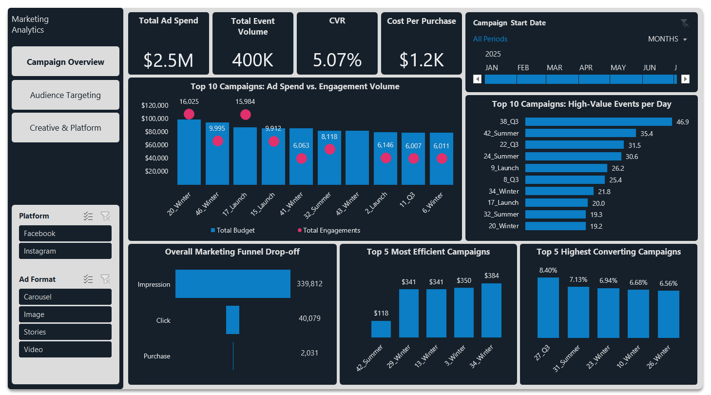
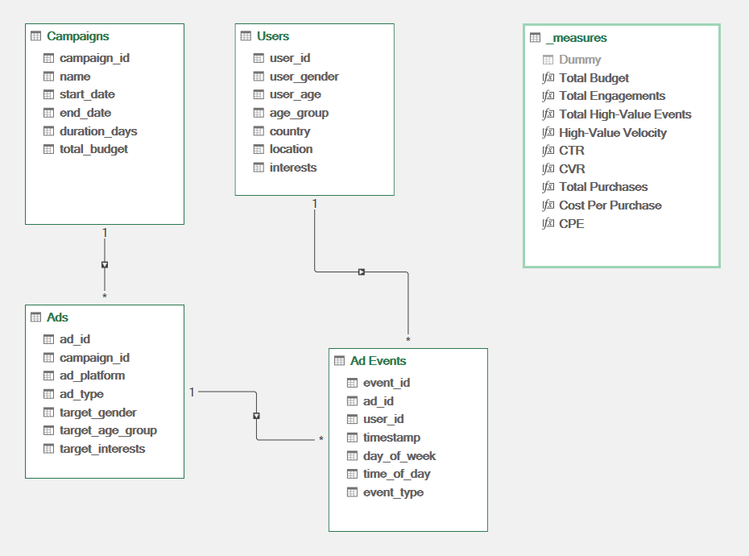
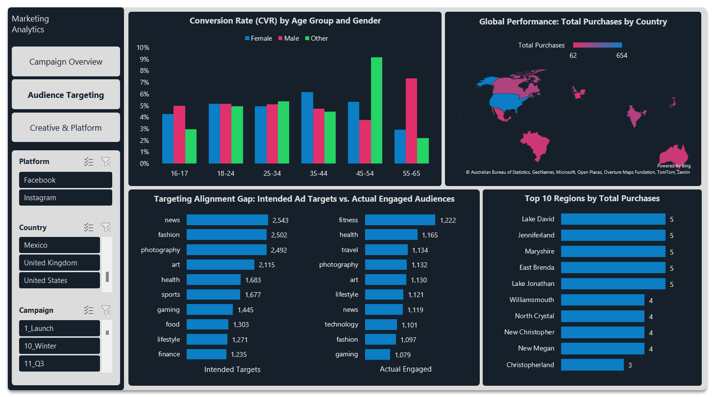
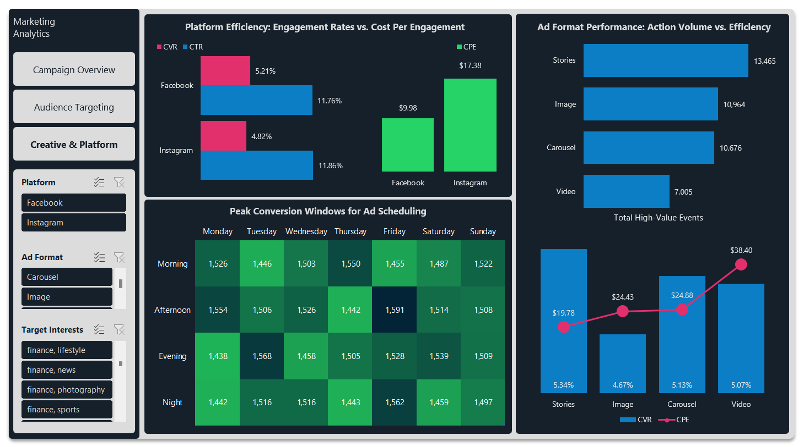

# 📊 Marketing Campaign Performance & Audience Optimization: Excel Analytics Dashboard




## 📋 Table of Contents
1. [Project Overview](#1--project-overview)
2. [The Business Problem](#2--the-business-problem)
3. [Tech Stack & File Structure](#3--tech-stack--file-structure)
4. [Python Data Inspection](#4--python-data-inspection)
5. [Data Cleaning & Power Query](#5--data-cleaning--power-query)
6. [Data Modeling & DAX](#6--data-modeling--dax)
7. [Dashboard Pages & Key Insights](#7--dashboard-pages--key-insights)
8. [How to Run This Project](#8--how-to-run-this-project)

---

## 1. 📋 Project Overview

This project is an end-to-end data analytics portfolio piece demonstrating the ability to transform raw marketing data into an interactive, executive-level Excel dashboard. By combining Python for exploratory data analysis with Power Query and DAX for robust data modeling, this dashboard provides actionable insights into campaign ROI, audience targeting gaps, and platform efficiency.

**Key Highlights:**
* **Data Processing:** Python (Pandas/NumPy) utilized for initial data validation, followed by Power Query for advanced ETL processes and duplicate resolution.
* **Data Modeling:** A highly optimized Snowflake Schema built within Power Pivot, utilizing DAX measures to calculate custom KPIs (CVR, CTR, Cost Per Purchase).
* **Dynamic Visualizations:** Custom helper tables incorporating logical cell functions (e.g., `=IF(H11="", "", H11)`) to handle blank values and ensure clean, dynamic chart rendering without visual anomalies.
* **Dataset:** The analysis processes over 400,000 ad events and 10,000 users. To adhere to repository best practices, the raw `.csv` files are excluded via `.gitignore`. The original dataset can be downloaded directly from [Kaggle](https://www.kaggle.com/datasets/alperenmyung/social-media-advertisement-performance).

## 2. 🎯 The Business Problem

**The Core Problem**
The marketing team is deploying substantial budgets across multiple campaigns, platforms, and demographics, but lacks visibility into exactly which combinations drive actual purchases versus just empty impressions. This creates inefficient budget drain, high customer acquisition costs (CAC), and missed revenue opportunities.

**The Goal**
Build an attribution and optimization model that identifies the highest-converting audience segments, optimal ad formats, and peak engagement times to reallocate future spend effectively.

## 3. 🛠️ Tech Stack & File Structure

**Technologies Used:**
* **Python (Pandas, NumPy):** Utilized within a Jupyter Notebook for initial Exploratory Data Analysis (EDA), schema validation, and anomaly detection.
* **Excel Power Query:** Served as the primary ETL tool to ingest raw CSVs, standardize data types, and resolve data anomalies (e.g., removing duplicate user IDs).
* **Excel Power Pivot (DAX):** Used to construct a relational Snowflake Schema and write custom DAX measures for calculating dynamic metrics like High-Value Velocity, CVR, and CPE.
* **Excel (Front-end):** Dashboard design and visualization, leveraging conditional logic (e.g., `=IF()`) for clean dynamic reporting.

**Repository Structure:**
```text
├── Assets/                # Dashboard screenshots and schema diagrams
│   ├── Page_1_Overview.png
│   ├── Page_2_Audience.png
│   ├── Page_3_Creative.png
│   └── data_model.png
├── Dataset/               # Data folder (Original CSVs excluded via .gitignore)
│   └── Raw/
│       └── .gitkeep
├── Excel/                 # Core dashboard application
│   └── Marketing_Campaign_Performance_Dashboard.xlsx
├── Python/                # Exploratory Data Analysis scripts
│   └── inspection.ipynb
├── .gitignore             # Ignores large raw dataset files
└── README.md              # Project documentation
```

## 4. 🐍 Python Data Inspection

Before importing the raw dataset into Excel, I conducted an initial Exploratory Data Analysis (EDA) using Python (Pandas) within a Jupyter Notebook. This pre-processing step was critical for validating data integrity, understanding table schemas, and planning the relational data model.

**Key Findings from the EDA:**
* **High Data Quality:** Confirmed **0 missing values (NaNs)** and **0 exact duplicate rows** across all four datasets (totaling over 400,000 records).
* **Crucial Anomaly Detected:** Discovered a primary key violation in the `users.csv` table. While the table contained 10,000 rows, the `.nunique()` function revealed only **9,950 unique `user_id`s**. Identifying this early dictated the exact deduplication strategy needed in Power Query to prevent "Many-to-Many" relationship errors during data modeling.
* **Funnel Validation:** Verified that the categorical values in the `event_type` column naturally formed a realistic marketing funnel (339,812 Impressions → 40,079 Clicks → 2,031 Purchases).

**Sample Inspection Script:**
```python
import pandas as pd

# Snippet of the comprehensive inspection function used
def inspect_data(df, name):
    print(f"\n📊 DATASET: {name.upper()}")
    print(f"Rows: {df.shape[0]:,} | Columns: {df.shape[1]:,}")
    print(f"Total Missing Values: {df.isnull().sum().sum()}")
    print(f"Total Duplicated Rows: {df.duplicated().sum():,}\n")
    
    # Checking unique counts to validate Primary Key integrity
    print("--- Unique Values Preview ---")
    for col in df.columns:
        print(f"• {col}: {df[col].nunique()} unique values")

# Applied iteratively across Ads, Campaigns, Users, and Ad Events
for name, df in datasets.items():
    inspect_data(df, name)
```

## 5. 🧹 Data Cleaning & Power Query

With the initial inspection complete, I utilized Excel's **Power Query** as the ETL engine to ingest the raw CSV files, standardize the data types, and prepare the tables for relational modeling.

**Key Transformation Steps:**
* **Duplicate Resolution (The PK Fix):** Applied `Table.Distinct` to the `Users` query to remove the duplicate `user_id` records identified during the Python EDA, ensuring a clean 1-to-Many relationship could be established.
* **Text Formatting:** Cleaned the `name` column in the `Campaigns` table by removing the redundant "Campaign_" prefix (using `Table.ReplaceValue`), resulting in a cleaner UI for the dashboard slicers and charts.
* **Type Standardization:** Strictly defined data types across all queries (e.g., converting `total_budget` to `Currency.Type` and `timestamp` to `DateTime.Date`) to optimize the data model's memory usage and DAX performance.

**Sample Power Query (M Code) - Users & Campaigns:**
```powerquery
// Users Query: Resolving the duplicate Primary Key
let
    Source = Csv.Document(File.Contents("Dataset\Raw\users.csv"),[Delimiter=",", Columns=7, Encoding=1252, QuoteStyle=QuoteStyle.None]),
    #"Promoted Headers" = Table.PromoteHeaders(Source, [PromoteAllScalars=true]),
    #"Changed Type" = Table.TransformColumnTypes(#"Promoted Headers",{{"user_id", type text}, {"user_gender", type text}, {"user_age", Int64.Type}, {"age_group", type text}, {"country", type text}, {"location", type text}, {"interests", type text}}),
    #"Removed Duplicates" = Table.Distinct(#"Changed Type", {"user_id"}) // Critical fix for data modeling
in
    #"Removed Duplicates"

// Campaigns Query: Text cleaning and type formatting
let
    Source = Csv.Document(File.Contents("Dataset\Raw\campaigns.csv"),[Delimiter=",", Columns=6, Encoding=1252, QuoteStyle=QuoteStyle.None]),
    #"Promoted Headers" = Table.PromoteHeaders(Source, [PromoteAllScalars=true]),
    #"Changed Type" = Table.TransformColumnTypes(#"Promoted Headers",{{"campaign_id", type text}, {"name", type text}, {"start_date", type date}, {"end_date", type date}, {"duration_days", Int64.Type}, {"total_budget", type number}}),
    #"Replaced Value" = Table.ReplaceValue(#"Changed Type","Campaign_","",Replacer.ReplaceText,{"name"}),
    #"Changed Type1" = Table.TransformColumnTypes(#"Replaced Value",{{"total_budget", Currency.Type}})
in
    #"Changed Type1"
```

## 6. 🗄️ Data Modeling & DAX

With the data cleaned and staged, I loaded the tables into **Power Pivot** to construct the relational data model and define the custom analytical metrics.



**The Relational Schema:**
The model is built on a cascading, highly optimized **Snowflake Schema**:
* **Dimension Tables:** `Campaigns`, `Ads`, and `Users` handle the descriptive attributes, hierarchies, and filtering contexts.
* **Fact Table:** `Ad Events` acts as the central fact table, capturing all transactional engagement data (400,000 rows).
* **Relationships:** Configured strict 1-to-Many (`1:*`) relationships (e.g., `Campaigns` → `Ads` → `Ad Events` and `Users` → `Ad Events`). This ensures seamless cross-filtering and accurate DAX measure propagation without ambiguity.

**Custom DAX Measures:**
To translate raw counts into actionable business KPIs, I created a dedicated `_measures` table. Here are a few critical DAX calculations driving the dashboard:

```dax
// Calculating Campaign Velocity (High-Value Actions per day)
High-Value Velocity := DIVIDE([Total High-Value Events], MAX('Campaigns'[duration_days]), 0)

// Conversion Rate (Bottom-of-Funnel Efficiency)
CVR := DIVIDE(
    CALCULATE([Total Engagements], 'Ad Events'[event_type] = "Purchase"), 
    CALCULATE([Total Engagements], 'Ad Events'[event_type] = "Click"), 
    0
)

// Customer Acquisition Cost / Cost Per Purchase
Cost Per Purchase := DIVIDE([Total Budget], [Total Purchases])
```

## 7. 💡 Dashboard Pages & Key Insights

The final Excel dashboard directly answers the core business questions defined at the project's outset, moving stakeholders from high-level ROI down to tactical, actionable changes.

### Page 1: Executive Campaign Overview


* **Budget vs. Volume:** A total ad spend of **$2.54M** generated **400,000** total engagements. 
* **Campaign Velocity:** Campaign **38_Q3** is driving the highest volume relative to its duration (46.9 high-value events/day), closely followed by **42_Summer** (35.4 events/day).
* **Funnel Drop-off:** The overall funnel shows a steep but expected drop: **339,812 Impressions ➔ 40,079 Clicks ➔ 2,031 Purchases**.
* **Cost of Acquisition:** While the overall average Cost Per Purchase is **$1,249**, the most efficient outlier (*42_Summer*) acquires purchasing users for just **$118**.
* **Audit Finding (Anomaly):** *Campaign 43_Winter* consumed an **$81,350** budget allocation but recorded zero tracking events, flagging a critical tracking failure or budget drain.

---

### Page 2: Audience & Demographic Targeting


* **Top Converting Demographics:** The highest conversion rates (CVR) originate from non-traditional segments: the **45-54 "Other"** demographic (9.15%) and the **55-65 "Male"** group (7.34%).
* **Geographic Outperformers:** The **United States** heavily dominates global purchases (654), while micro-regions like **Lake David** and **Jenniferland** lead at the local level.
* **The Targeting Mismatch:** There is a massive gap between intended targets and actual converters. Ad spend was heavily directed toward *News* and *Fashion*, but the users who actually converted were highly engaged with *Fitness*, *Health*, and *Travel*. 

---

### Page 3: Creative & Platform Optimization


* **Platform Efficiency:** **Facebook** is significantly more cost-effective, delivering a **$9.98 Cost Per Engagement (CPE)** compared to Instagram's $17.38, while also maintaining a slightly higher CVR (5.21% vs 4.82%).
* **Top Ad Format:** **Stories** are the definitive top-performing format. They drive the highest volume of high-value actions (13,465) and the highest CVR (5.34%) at the lowest cost ($19.78 CPE).
* **Peak Scheduling Windows:** The heatmap proves ad delivery should be heavily weighted toward **Friday Afternoons** (1,591 events), **Tuesday Evenings** (1,568), and **Friday Nights** (1,562) for maximum engagement.

## 8. 🚀 How to Run This Project

1. **Clone the Repository:**
   ```bash
   git clone https://github.com/ZoranG99/Marketing-Campaign-Performance-and-Audience-Optimization.git
   ```

2. **Review the EDA (Optional):**
   Navigate to the `/Python` folder and open `inspection.ipynb` in Jupyter Notebook or VS Code to view the initial data validation and anomaly detection steps.

3. **Open the Dashboard:**
   Navigate to the `/Excel` folder and open `Marketing_Campaign_Performance_Dashboard.xlsx`.

   *Note: The raw CSV files are excluded from this repository to adhere to file size limits and best practices. However, the data model and Power Query connections are fully preserved within the Excel file. If you wish to refresh the queries yourself, download the raw data from [Kaggle](https://www.kaggle.com/datasets/alperenmyung/social-media-advertisement-performance), extract the CSVs into the `/Dataset/Raw/` folder, and update the source file paths in Power Query.*
